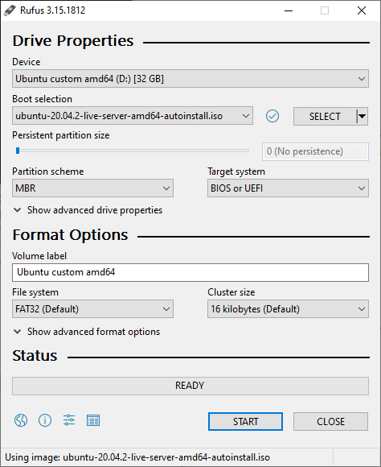

# Rocket Pool Node Provisioning

Steps I used to provision a Rocket Pool node on my Intel NUC. For development, I used Vagrant with Oracle VM VirtualBox.  _Huge thank you to [@tedsteen](https://github.com/tedsteen) for uploading [this repo](https://github.com/CryptoGnut/rocketpool-node-provision) so I could learn from him and develop my own provisioning steps!_

## High-level Steps
1. [Configure Control Node](#configure-control-code)
2. [Install Ubuntu Server on Target Node](#install-ubuntu-server-on-target-node)
3. [Verify SSH Access to Target Node](#verify-ssh-access-to-target-node)
4. [Prepare Target Node OS and Create Rocket Pool User](#prepare-target-node-os-and-create-rocket-pool-user)
5. [Install Rocket Pool Smart Node Stack](#install-rocket-pool-smart-node-stack)
6. [Configure Aegis Secure Key](#configure-aegis-secure-key)

## Configure Control Node
Used Ubuntu in WSL2 on Windows 10 as control node.
### Configure SSH
1. 	Add host mappings to /etc/hosts:
```bash
# Physical Rocket Pool host - Fixed IP address
10.0.0.72        nuc1
# Vagrant Rocket Pool VM - Not sure how Vagrant chose this IP address 
172.19.208.1     vagrant-rp1
```
2. Copy existing key pair files to `~/.ssh`, or generate new key pair using:
```bash
ssh-keygen -t ed25519 -C "your_email@example.com"
```
3. Add `loadkey` alias to `~/.bashrc`. I generated my ssh keys with a passphrase. Running `loadkey` in any new shell saves having to enter the passphrase every time `ssh` is used.
```bash
alias loadkey='eval "$(ssh-agent -s)"; ssh-add ~/.ssh/id_ed25519'
```
### Install Ansible and dependencies
I used `pip` instead of `apt` to install Ansible to gain access to newer Ansible version.
```bash
sudo apt install python3-pip
pip3 install --user ansible
```
Close/reopen unbuntu terminal.
```bash
ansible-galaxy collection install community.general
ansible-galaxy install dev-sec.os-hardening dev-sec.ssh-hardening jnv.unattended-upgrades geerlingguy.docker
```
## Install Ubuntu Server on Target Node
### Physical host
Used Ubuntu in WSL2 on Windows 10 to generate an Ubuntu Server 20.04 LTS auto intall iso image following [this](https://gist.github.com/s3rj1k/55b10cd20f31542046018fcce32f103e) Howto. 
1. Download ISO Installer:
```bash
wget https://ubuntu.volia.net/ubuntu-releases/20.04.2/ubuntu-20.04.2-live-server-amd64.iso
```

2. Create ISO distribution directory:
```bash
mkdir -p iso/nocloud/
```

3. Extract ISO using 7z:
```bash
7z x ubuntu-20.04.2-live-server-amd64.iso -x'![BOOT]' -oiso
```

4. Create empty meta-data file:
```bash
touch iso/nocloud/meta-data
```

5. Copy [user-data](iso/nocloud/user-data) file to `iso/nocloud/user-data`. *Review/update user-data file before proceeding.  Encrypted password and SSH public key are missing and must be provided.*

6. Update boot flags with cloud-init autoinstall:
```bash
sed -i 's|---|autoinstall ds=nocloud\\\;s=/cdrom/nocloud/ ---|g' iso/boot/grub/grub.cfg
sed -i 's|---|autoinstall ds=nocloud;s=/cdrom/nocloud/ ---|g' iso/isolinux/txt.cfg
```

7. Disable mandatory md5 checksum on boot:
```bash
md5sum iso/.disk/info > iso/md5sum.txt
sed -i 's|iso/|./|g' iso/md5sum.txt
```
8. Create Install ISO from extracted dir:
```bash
xorriso -as mkisofs -r \
  -V Ubuntu\ custom\ amd64 \
  -o ubuntu-20.04.2-live-server-amd64-autoinstall.iso \
  -J -l -b isolinux/isolinux.bin -c isolinux/boot.cat -no-emul-boot \
  -boot-load-size 4 -boot-info-table \
  -eltorito-alt-boot -e boot/grub/efi.img -no-emul-boot \
  -isohybrid-gpt-basdat -isohybrid-apm-hfsplus \
  -isohybrid-mbr /usr/lib/ISOLINUX/isohdpfx.bin  \
  iso/boot iso
```
9. Burn iso image to USB flash drive using Rufus on Windows.

10. Boot Rocket Pool node from USB flash drive image to complete the unattended install.

### Vagrant VM
```bash
ansible-playbook vagrant.yaml
```

### Verify SSH access to Target Node
If physical host:
```bash
ssh dan@nuc1
```
If Vagrant VM:
```bash
ssh -p 2222 dan@vagrant-rp1
```
*If receive `WARNING: REMOTE HOST IDENTIFICATION HAS CHANGED!`, delete offending key from `~/.ssh/known_hosts` on local host.*

## Prepare Target Node OS and Create Rocket Pool User
```bash
# Cd to project directory
cd ~/git/rocketpool-node-provision

# Configure environment.  For vagrant: ./env.sh vagrant
./env.sh <environment> <target-node-ip>

# Do base provisioning 
ansible-playbook base.yaml --ask-become-pass
```

## Install Rocket Pool Smart Node Stack
_Work in progress_
```bash
# Install Rocket Pool Smart Node stack
ansible-playbook install-rocketpool.yaml --ask-become-pass
```
## Configure Aegis Secure Key
Follow steps [here](https://github.com/htimsk/SecureKey) only to configure and format Secure Key.  Unlock and insert Secure Key in _always on_ USB port (blue ports on NUC).  To configure blue USB ports to remain powered through reboot and shutdown, enable "USB S4/S5 Power" under "Secondary Power Settings" in the BIOS. Then run following playbook which will stop rocketpool, move `~/.rocketpool/data` to Secure Key, and then restart rocketpool.
```bash
# Move ~/.rocketpool/data to Secure Key
ansible-playbook configure-secure-key.yaml --ask-become-pass
```